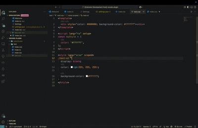
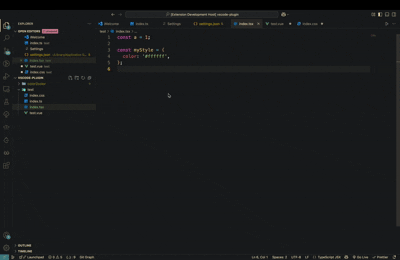

# Color2Color

[https://github.com/YuanG1944/Color2Color](https://github.com/YuanG1944/Color2Color)

A VSCode extension for converting between RGB and Hex.

## How to use

1.Using codeLens


2.Using Right click


## Default Config

```json
{
  "color2color.enableCodeLens": true,
  "color2color.languages": [
    "css",
    "scss",
    "less",
    "typescript",
    "typescriptreact",
    "vue",
    "javascript",
    "javascriptreact"
  ]
}
```

#### If you find it helpful, please give it a star. 💗
